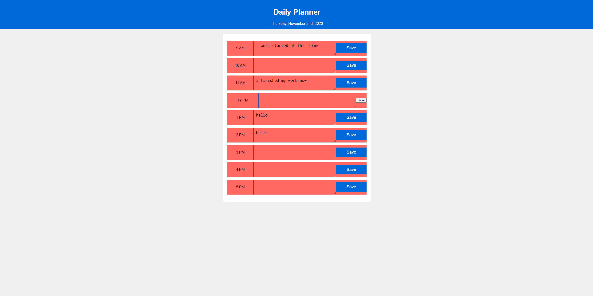

# week-05---Third-Party-APIs---Work-Day-Scheduler

## user story
AS AN employer
I WANT to view a potential employee's deployed portfolio of work samples
SO THAT I can review samples of their work and assess whether they're a good candidate for an open position

## Key Features

Current Date Display: The application displays the current date at the top of the calendar, providing users with real-time information.

Hourly Time Blocks: Users are presented with time blocks for standard business hours from 9 AM to 5 PM, making it easy to schedule and plan their day.

Color-Coded Time Blocks: Time blocks are color-coded to indicate whether they are in the past (red), present (green), or future (also green). This visual cue helps users quickly identify the current status of each time block.

Event Entry: Users can click into a time block to enter and save events, making it a convenient tool for managing daily schedules and tasks.

Local Storage: Events are saved in local storage, ensuring that the text for each event persists even when the page is refreshed or closed. This feature allows users to maintain a record of their planned activities.

Add Row Functionality: The application provides an "Add Row" button, allowing users to dynamically add new rows for additional hours, making it adaptable for various scheduling needs.

## Deployment
https://yasirjamah123.github.io/week-05---Third-Party-APIs---Work-Day-Scheduler/

## Screenshots
